# SNS Blog
## Overview

## File Description
+ StoryBoard.Login.jsp: 초기 페이지로 로그인 및 회원가입 기능 구현
+ StoryBoard.MakeAccount.jsp : 회원가입 페이지로 아이디, 비밀번호, 생일, 이름, 프로필 사진을 입력 받음
+ StoryBoard.MakeAccount_do.jsp : 회원DB에 회원 정보를 저장
+ StoryBoard.Login_ok.jsp : 로그인 정보가 DB상의 정보와 일치하는지 확인하고 일치하면 메인 페이지로 접속
+ StoryBoard.Main.jsp : 로그인 후 메인 페이지
+ StoryBoard.SearchPost.jsp : 검색어를 입력했을 때 게시글 제목이나 내용이 해당 검색어를 포함하고 있으면 해당 게시글들이 표시되는 페이지
+ StoryBoard.MakePost.jsp : 게시글을 작성하는 페이지로 게시글의 제목, 게시판, 사진, 내용을 입력받음
+ StoryBoard.MakePost_do.jsp : 작성한 게시글을 DB에 저장
+ StoryBoard.ShowPost.jsp : 메인 페이지에서 게시글의 제목을 클릭했을 때 해당 게시글을 확인할 수 있는 페이지
+ StoryBoard.PostLike_do.jsp : 게시글에서 게시글을 추천했을 때 추천수를 올려 다시 DB에 저장하는 파일
+ StoryBoard.Modify_Post.jsp : 게시글을 수정하기 위한 페이지로 수정버튼을 눌렀을 때 DB에서 해당 게시글에 대한 정보를 가지고 와 수정이 가능
+ StoryBoard.Modify_Post_do.jsp : 수정된 정보들을 DB에 다시 저장
+ StoryBoard.Delete_Post_do.jsp : 게시글을 삭제하는 페이지로 게시글을 삭제할건지 확인하고 확인을 누르면 해당 게시글을 삭제
+ StoryBoard.AddComment_do.jsp: 해당 게시글에 댓글을 추가하는 페이지로 해당 게시글에 대한 댓글을 DB에 저장함.
+ StoryBoard.ModifyComment.jsp : 댓글을 수정하기 위한 페이지로 수정 버튼을 클릭하면 팝업창이 나오면서 댓글을 수정하고 팝업창이 종료되면서 부모창을 새로고침
+ StoryBoard.ModifyComment_do.jsp : 수정된 댓글을 DB에 저장
+ StoryBoard.DeleteComment_do.jsp : 댓글을 삭제하는 페이지로 DB에서 해당 댓글 삭제

## Execution Results
+ **Initial Page**  
    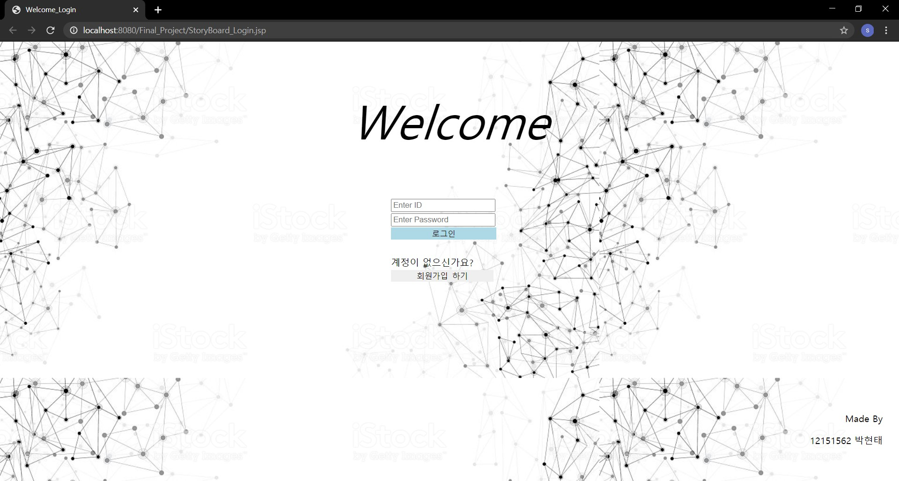
 

+ **Make Account Page**  
    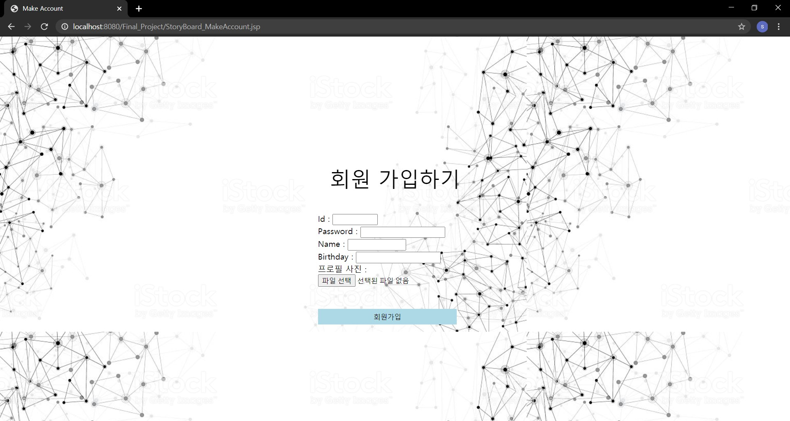
    + 회원가입을 위한 ID, 비밀번호, 이름, 생일, 프로필 사진을 입력받고 이를 DB에 저장
 

+ **Main Page**  
    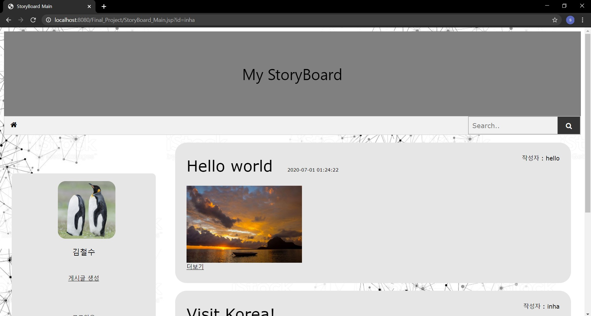
    + 메인 화면으로 프로필과 게시글 내용이 표시됨
    + 메인 화면의 헤더 부분과 메뉴부분에서 왼쪽에 집모양의 버튼을 클릭하면 현재 화면인 메인 화면으로 돌아옴  
    
    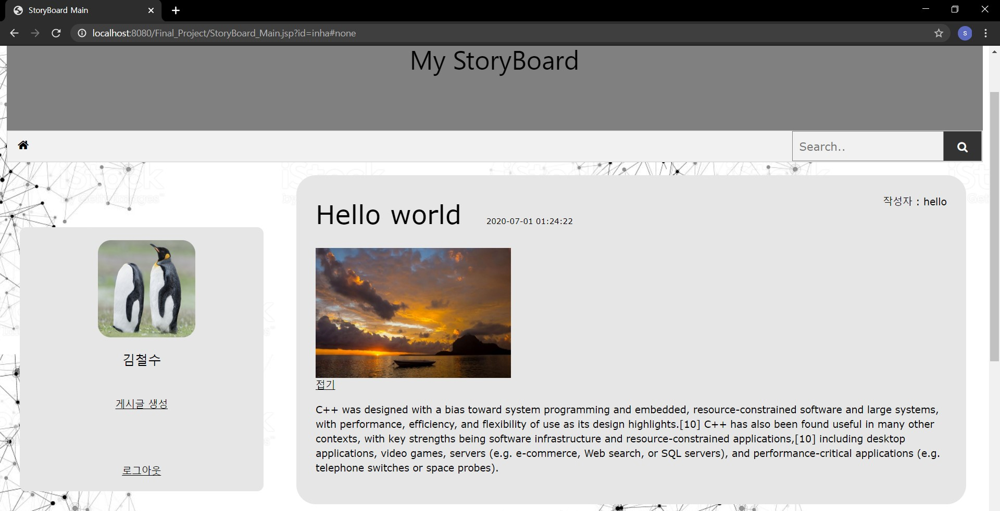 
    + 게시글 내용이 100자 이상이면 더보기로 표시되고 더보기를 클릭하면 위와 같이 더보기가 접기로 바뀌면서 글이 펼처짐
 

+ **게시글 검색**
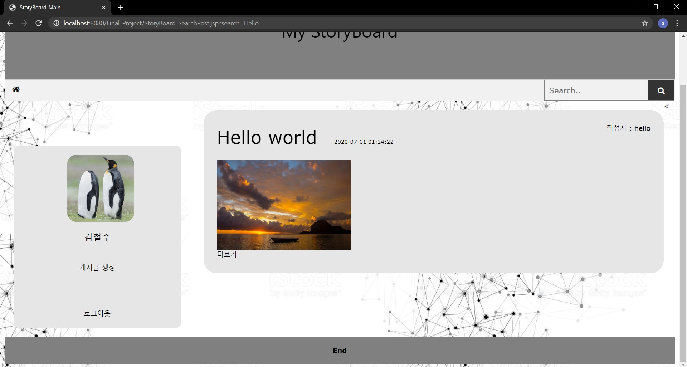
 

+ **게시글 작성**
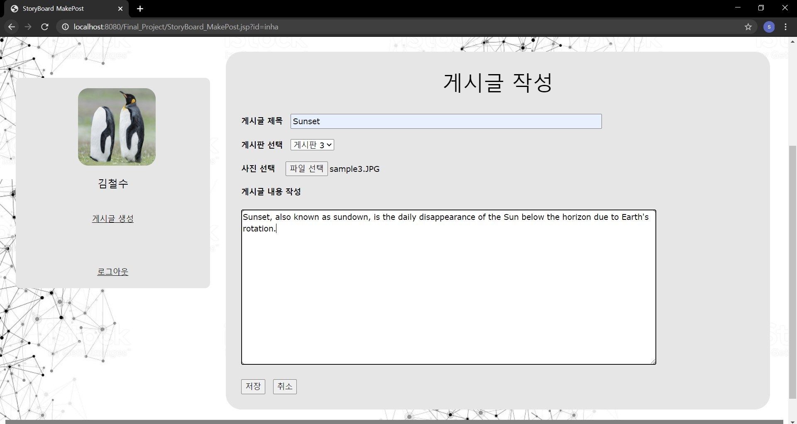
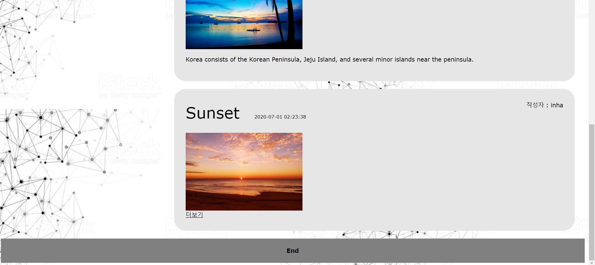
 

+ **게시글 보기**
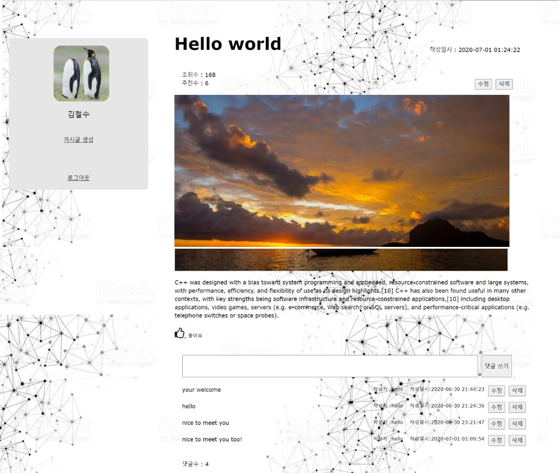
 

+ **추천하기**
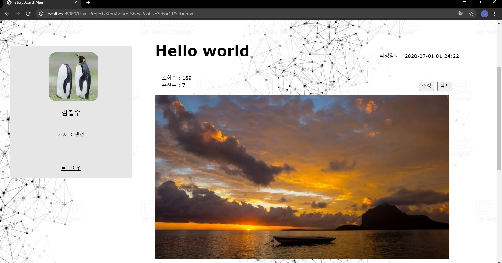
 

+ **게시글 수정**
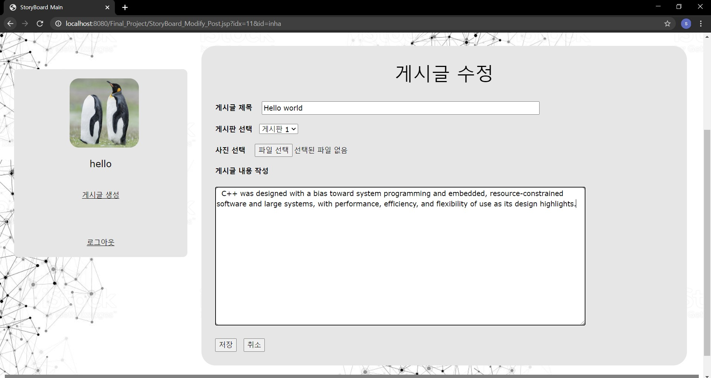

 

+ **게시글 삭제**
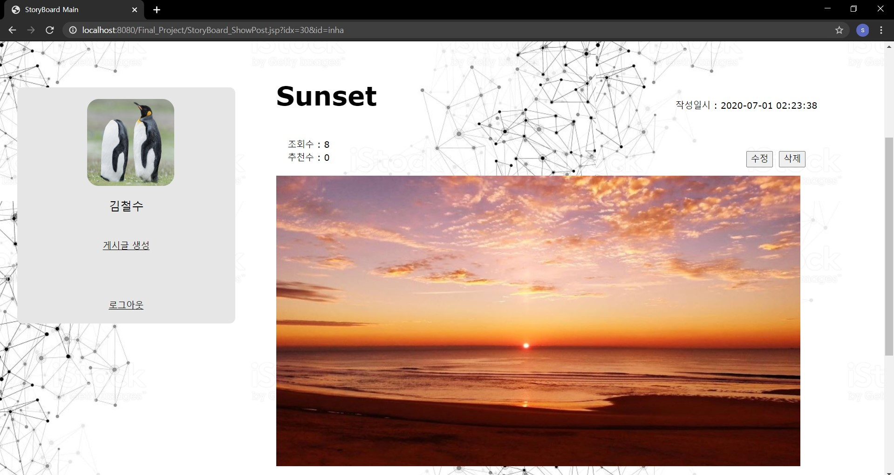
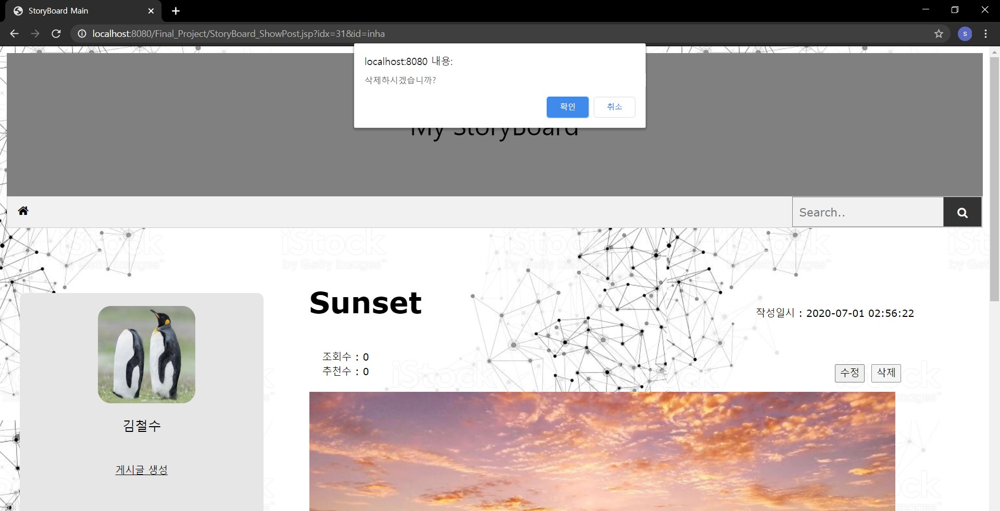
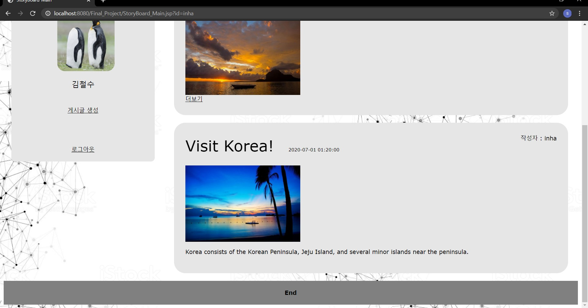
 

+ **댓글 입력**
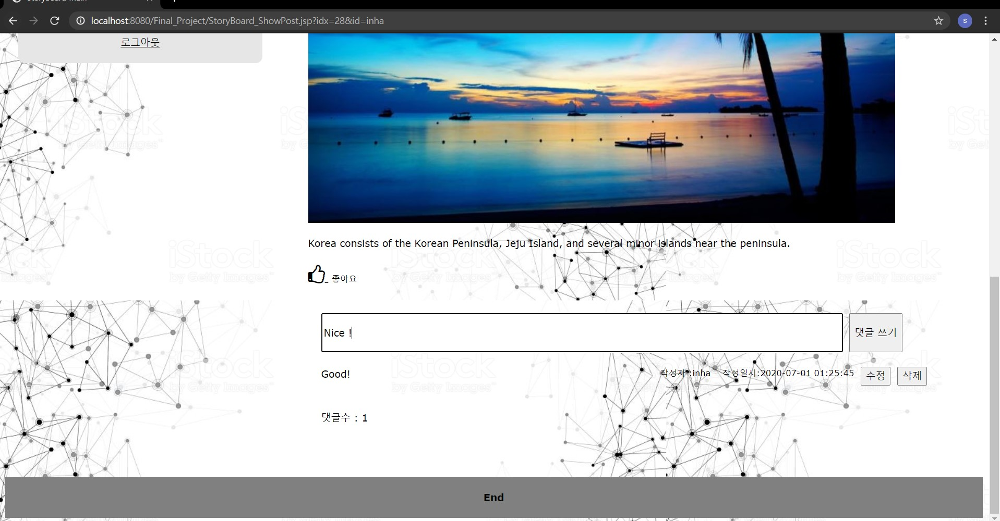

 

+ **댓글 수정**
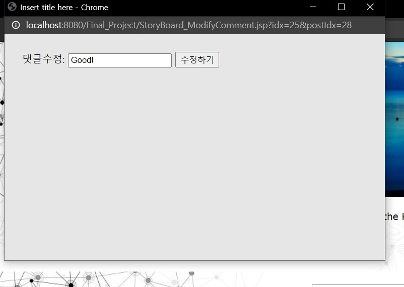
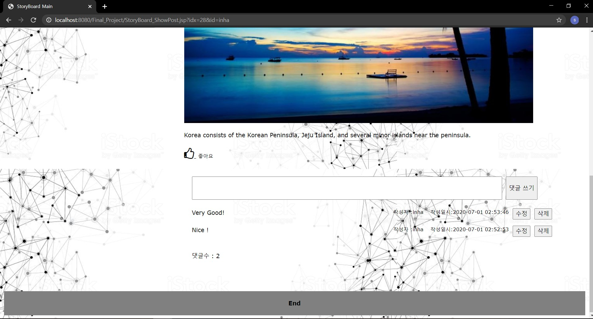
 

+ **댓글 삭제**
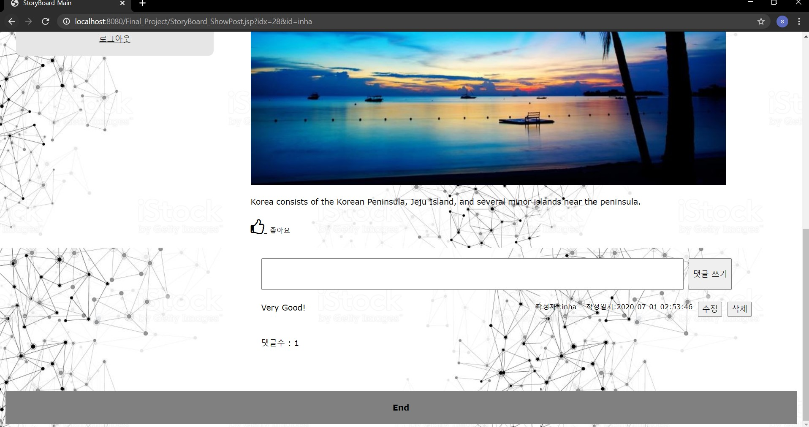
